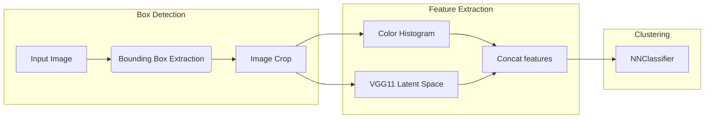
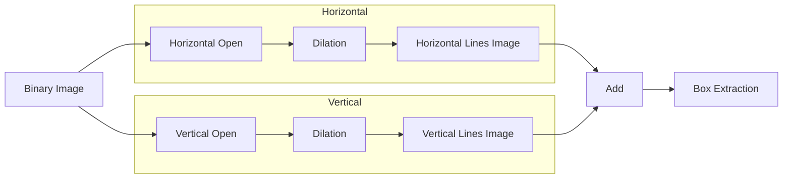
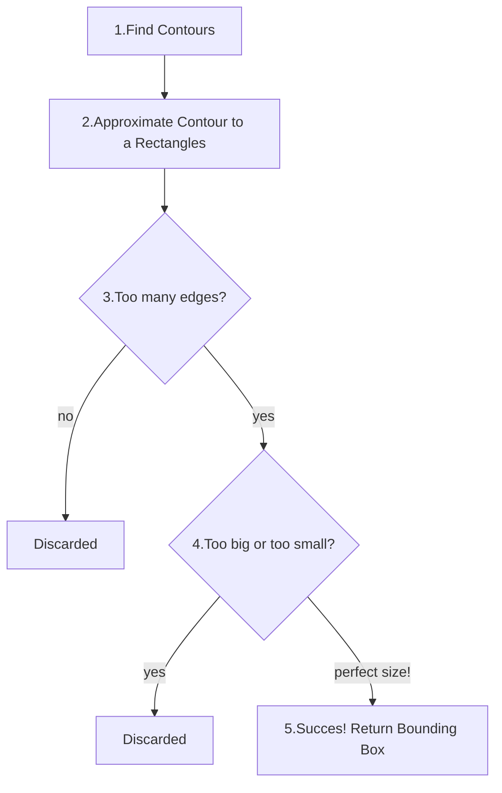

# Image Processing Final Project
The goal of this project is to identify and classify a certain type of tv ad.

<p align="center">

</p>
In particular we desire to extract and classify those rectangular ads that can be seen at the bottom.

####  Here we present an overview of the project

### Bounding Box Extraction
Let's begin by understanding how does the **bounding box extraction** process works.


In the first step we apply a **blur** kernel to filter out the high frequency noise present in low quality images. This helps in the following step to avoid noise amplification.
<p align="center">

</p>
This step is followed by performing classic edge detection with Canny

<p align="center">

</p>
It can already be seen that this image contains a great ammount of edges. Most of them are not relevant to our case. It is worth noting that the straight edges are far from perfect.

<br></br>

We continue by performing a **dilate-erode** operation, also known as a **close** operation. This is applied in order to fill in the gaps that some contours may have. As the images we are dealing with of very low quality this steps provides stronger, more continous edges to apply further processing.

**Dilate**
<p align="center">

</p>

**Erode**
<p align="center">

</p>
Mmm 🤔 this still looks quite noisy as there are so many useless polygons and edges on this image. This makes polygon finding a lot harder and can definitely be improved.

---

Let's recall that are goal is to recover the outline of the ads. Therefore we propose a simple method based on <a href="https://docs.opencv.org/4.x/d4/d76/tutorial_js_morphological_ops.html">morphological</a> operations to extract and extend the horizontal and vertical segments.

We split the image into its horizontal and vertical components by performing an Open operation with a big kernel and 2 iterations. This allows us to preserve those nice large vertical segments present in the image and discard those small noisy edges.

```python
# create kernel
vertical_kernel = cv.getStructuringElement(cv.MORPH_RECT, (1, 30))
# extract largest vertical segments
vertical_mask = cv.morphologyEx(binary_image, cv.MORPH_OPEN vertical_kernel, iterations=2)
# Extend those segments
vertical_mask = cv.dilate(vertical_mask, vertical_kernel, iterations=10)
```
The same procedure is applied for the horizontal components




Applying the **Open** operation we get


|                     Horizontal segments                      |                              Extended                               |
| :----------------------------------------------------------: | :-----------------------------------------------------------------: |
|  |  |


After applying the **dilation** operation we get

|                     Vertical segments                      |                             Extended                              |
| :--------------------------------------------------------: | :---------------------------------------------------------------: |
|  |  |
## Let's add them 😄!

<p align="center">

</p>

Removing all unwanted edges allows us to focus only in the polygons of interest. We can now see clearly two rectangles.

Using OpenCV tools to find polygons we set ourselves to find rectangles.



Read the following section to gain further understading of the steps involved.

__Step 1:__ Find all contours
```python
contours, hierarchies = cv.findContours(
                image, cv.RETR_TREE, cv.CHAIN_APPROX_SIMPLE
            )
```
__Step 2:__ Approximate Contour to a Rectangles
```python
epsilon = 0.05 * cv.arcLength(countour, True)
cnt = cv.approxPolyDP(countour, epsilon, True)
```
__Step 3 and 4:__ Discard complex shapes and remove contours with extreme surface area, either too big or too small.
If the contour meets this criteria then we make approximate that contour as a rectangle and save the extracted bounding box 👍
```python
if 4 <= len(cnt) < self.max_polig:
    if cv.isContourConvex(cnt):
        boundRect_temp = cv.boundingRect(cnt)
        if low_area_th < bxu.rect_area(boundRect_temp) < high_area_th:
            box = boundRect_temp
```


<p align="center">


Finally, just crop the images. We made sure to keep track of the parent-child relationship between images by storing them into a dataframe.
<p align="center">


</p>
# End result! 🥳
<p align="center">

</p>


---
# Feature extraction
In order to clusterize the ads we need to extract some kind of feature vector that allows us to compare them.
Such feature vector, in our case, is composed of the concatention of the **feature space output** of a pretrained VGG11 model and a **color histogram**.
In this manner we are to combine both classic and sota approaches towards the computation of a rich feature vector.
# Clustering and Classification

We trained a Nearest Neighbors classifier in order to find where does the same ad appear.

The euclidean metric was used to determine similarity.


<p align="center">

</p>

In this example, we see the **DENIM MARKET** ad appearing in all those images
