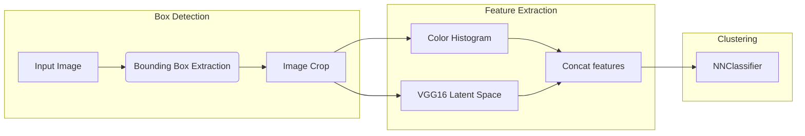
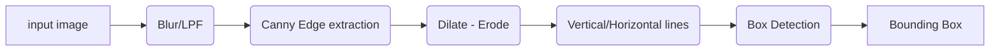

# Image Processing FinalProject
The goal of this project is to identify and classify a certain type of tv ad.

In particular we desire to extract and classify those rectangular ads that can be seen at the bottom.

  
Here we present an overview of the project

Let's begin by understanding how does the **bounding box extraction** process works.

In the first step we apply a **blur** kernel to filter out the high frequency noise present in low quality images. This helps in the following step to avoid noise amplification.

This step is followed by performing classic edge detection with Canny

It can already be seen that this image contains a great ammount of edges. Most of them are not relevant to our case. It is worth noting that the straight edges are far from perfect.

  

We continue by performing a **dilate-erode** operation, also known as **close**. This is applied in order to fill in the gaps that some contours may have. As the images we are dealing with of very low quality this steps provides stronger, more continous edges to apply further processing.

