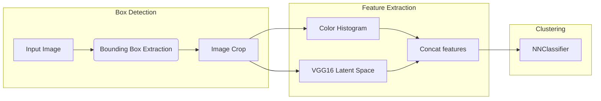
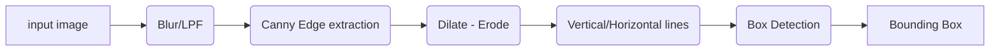

# Image Processing FinalProject
The goal of this project is to identify and classify a certain type of tv ad.

In particular we desire to extract and classify those rectangular ads that can be seen at the bottom.

  
Here we present an overview of the project

# Bounding Box Extraction
Let's begin by understanding how does the **bounding box extraction** process works.

In the first step we apply a **blur** kernel to filter out the high frequency noise present in low quality images. This helps in the following step to avoid noise amplification.

This step is followed by performing classic edge detection with Canny

It can already be seen that this image contains a great ammount of edges. Most of them are not relevant to our case. It is worth noting that the straight edges are far from perfect.

  

We continue by performing a **dilate-erode** operation, also known as **close**. This is applied in order to fill in the gaps that some contours may have. As the images we are dealing with of very low quality this steps provides stronger, more continous edges to apply further processing.

## Let's wrap it up

Removing all the unwanted edges allows us to focus on only the polygons of interest. We can clearly see two rectangles where the ads are.

After applying OpenCVs tool to find polygons and discarding those which are really small. We get

Finally, just crop the images. We made sure to keep track of the parent-child relationship between images by storing them into a dataframe.

# Feature extraction
In order to clusterize the ads we need to extract some kind of feature vector that allows us to compare them.
Such feature vector, in our case, is composed of the concatention of the **feature space output** of a pretrained VGG11 model and a **color histogram**.
In this manner we are to combine both classic and sota approached towards the computation of a feature vector.

Technically it is not necessary to to include the color histogram but the course requires to solve this problem with a classic approach.
# Clustering and Classification

We trained a Nearest Neighbors classifier in order to find where does the same ad appear.

The euclidean metric was used to determine similarity.

In this example, we see the **DENIM MARKET** ad appearing in all those images